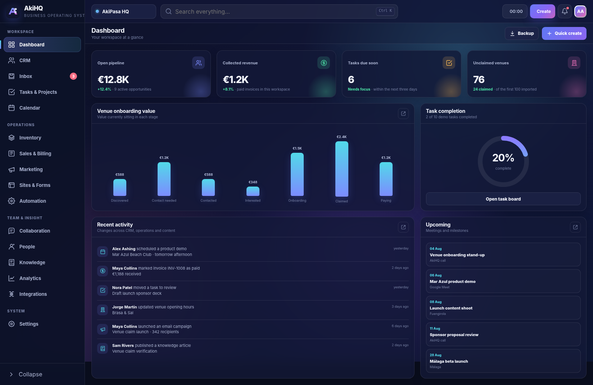

# AkiHQ

**AkiHQ is an original, open-source, local-first business operating system.** It combines CRM, projects, inbox, calendar, stock, invoicing, marketing, internal collaboration, reporting and integration management in one browser app.

This repository contains a **working alpha**, not a mock-up and not a prompt for another AI to build later. It runs without npm, Docker or a VPS.



## Start it

### Windows — easiest

1. Extract the ZIP.
2. Double-click `start-windows.bat`.
3. A browser opens at `http://127.0.0.1:8080`.

Python 3 is the only requirement for the local web server. You can also double-click `index.html`; nearly everything still works, but installable-PWA and service-worker features need `http://` or `https://`.

### macOS or Linux

```bash
chmod +x start.sh
./start.sh
```

Or run:

```bash
python3 -m http.server 8080 --bind 127.0.0.1
```

Then visit `http://127.0.0.1:8080`.

## What already works

- Dashboard metrics, activity, tasks, revenue and pipeline summaries
- CRM deals, leads, contacts and companies
- Multiple pipelines, Kanban drag-and-drop, list view and record drawers
- Lead conversion into contact, company and deal records
- Shared inbox with conversations and local replies
- Tasks, projects, board/list views, deadlines and work timer
- Calendar events and month navigation
- Product catalogue, warehouses and stock adjustments
- Quotes and invoices with printable documents
- Campaigns, audiences and marketing performance
- Landing-page and form records
- Automation-rule records and enable/disable controls
- Team feed, posts, comments and reactions
- Employee directory and HR-lite records
- Knowledge-base articles with Markdown rendering
- Analytics and funnel views
- Integration marketplace and connection configuration
- JSON backup/restore, CSV export and Bitrix24 CSV migration
- Global search, command palette (`Ctrl/Cmd + K`), notifications and themes
- English/Spanish interface setting, responsive layout and offline app shell
- Optional Supabase account sign-in and encrypted-in-transit workspace snapshot sync

The default workspace is filled with realistic demonstration data so the app is useful the moment it opens. Use **Settings → Data → Reset demo workspace** when you need a clean reset.

## Data model and privacy

By default, all workspace data is stored in the browser's `localStorage` on that device. No account or external server is required.

Use **Dashboard → Backup** regularly. Browser storage can be removed if site data is cleared, a browser profile is deleted or private-browsing storage expires.

The optional Supabase feature uploads one complete JSON workspace snapshot per authenticated user. It is suitable for personal backup/sync in this alpha. It is **not yet a conflict-safe, real-time, multi-user collaboration engine**.

## Deploy with no VPS

### Cloudflare Pages

Upload this whole folder to a Cloudflare Pages project, or connect the repository to Pages. It is a static app, so there is no build command and the output directory is the repository root.

Suggested settings:

```text
Framework preset: None
Build command:     (leave blank)
Output directory:  /
```

The included `_headers` file adds sensible browser security headers.

### Optional Supabase cloud backup

1. Create a Supabase project.
2. Run `supabase/schema.sql` in the SQL editor.
3. Enable Email/Password authentication.
4. Put the project URL and anon key in `config.js`.
5. Open **Settings → Cloud sync** inside AkiHQ.

The anon key is expected to be visible in a browser app. Row Level Security in the included schema is what prevents users from reading each other's snapshots.

### Optional Cloudflare integration gateway

The `cloudflare/` folder contains a deployable Worker for integrations that cannot safely expose secrets in a browser. It currently includes authenticated endpoints for:

- Resend email
- Slack notifications
- Discord notifications
- Telegram bot messages
- Twilio SMS
- Incoming provider-webhook storage in Supabase
- Allow-listed generic outgoing webhooks

See `docs/DEPLOY.md` and `docs/INTEGRATIONS.md`.

## Integration honesty department

AkiHQ contains configuration screens and a provider catalogue for the major CRM/business integrations. External OAuth services do not become live just because their logo appears on a card. Gmail, Microsoft, Meta, Stripe, Zoom and similar services require your own developer application, credentials, approval scopes, callback URLs and provider-specific code.

The browser app, import/export flows, local modules, Supabase snapshot sync and included Worker endpoints are implemented. The remaining provider cards are clearly marked as setup/adapters rather than pretending to be connected. No smoke, mirrors or tiny salesman living in the ZIP.

## Project structure

```text
assets/                 App JavaScript, CSS and logo
cloudflare/             Optional secret-holding integration Worker
supabase/schema.sql     Optional cloud snapshot and webhook-event schema
docs/                   Architecture, features, deployment and test notes
config.js               Optional public browser configuration
index.html              App entry point
manifest.webmanifest    Installable PWA metadata
sw.js                   Offline shell service worker
```

## Current scope

AkiHQ is a solid local-first alpha and a strong base for a proper hosted product. It is not yet a drop-in replacement for every Bitrix24 enterprise feature. In particular, production multi-user permissions, simultaneous editing, complete mail ingestion, voice/video calling, payroll, accounting compliance and every third-party OAuth adapter require further backend work and provider credentials.

See `docs/FEATURES.md` for the precise implemented/adapter/planned split.

## Licence

Apache License 2.0. See `LICENSE`.
